# BinaRena

[](https://opensource.org/licenses/BSD-3-Clause)


**Binarena** ("bin arena") is an interative visualizer that facilitates human-guided exploration and binning of metagenomic contigs.

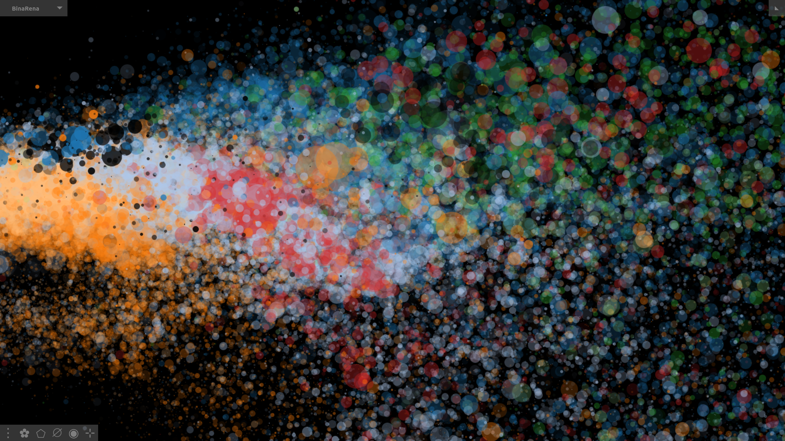
> _Screenshot of BinaRena displaying a tropical peatland metagenome_


## [Live demo](https://qiyunlab.github.io/binarena/demo.html)

Check out this [live demo](https://qiyunlab.github.io/binarena/demo.html). It is a fully functional program with a pre-loaded sample [dataset](https://www.ncbi.nlm.nih.gov/assembly/GCA_003604395.1/). Once you are familiar with the program, you may close the data, then drag and drop your own data into the interface and start to explore!


## ~~Installation~~

[Download](https://github.com/qiyunlab/binarena/archive/refs/heads/master.zip) this program, unzip, and double-click "**BinaRena.html**". That's it!

BinaRena is a client-end web application. It is written in vanilla JavaScript, without using any third-party library. it does not require installation, nor does it require a web server running in the backend. In other words, it is literally a single webpage running in your browser (see [details](#faq)).


## Contents

- [Main interface](#main-interface) | [widget buttons](#widget-buttons) | [mouse and keyboard](#mouse-and-keyboard-shortcuts)
- **Input**: [data table](#data-table) | [data types](#data-types) | [special columns](#special-columns) | [table view](#table-view)
- **Plot**: [auto-assign](#automatic-assignment) | [scaling](#legends-and-data-scaling) | [transformation](#data-transformation) | [coloring](#color-coding) | [image export](#image-export)
- **Contig**: [select](#contig-selection) | [mask](#contig-masking) | [highlight](#contig-highlighting) | [summary](#contig-summary) | [search](#contig-searching) | [mini plot](#mini-plot)
- **Binning**: [Binning plan](#binning-plan) | [table of bins](#table-of-bins) | [from selection to bin](#from-selection-to-bin)
- **Metrics**: [Plan evaluation](#binning-confidence-evaluation) | [plan comparison](#binning-plan-comparison) | [completeness & redundancy](#completeness--redundancy-calculation)
- [FAQ](#faq) | [scripts](scripts) | [citation](#citation) | [contact](#contact)


## Main interface

The main interface of BinaRena is an interactive scatter plot. It focuses on the display while minimizing other visual elements to let the user concentrate on the research task. Panels can be expanded / hidden on demand. Most functions (buttons) are only visible when the user moves the mouse over relevant items.

Here is the fully expanded main interface of BinaRena.

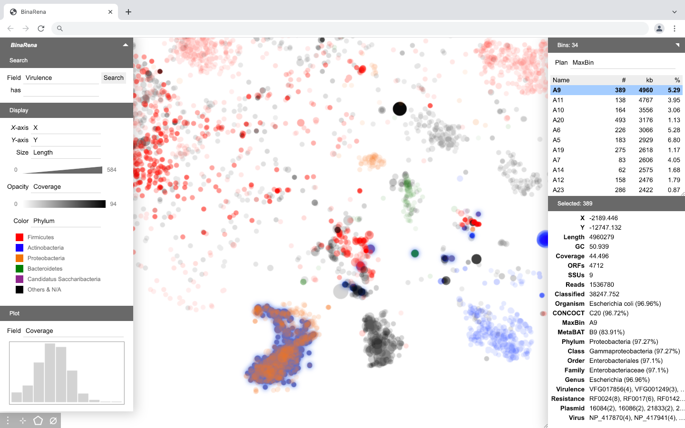

Here is the default interface when the program starts.

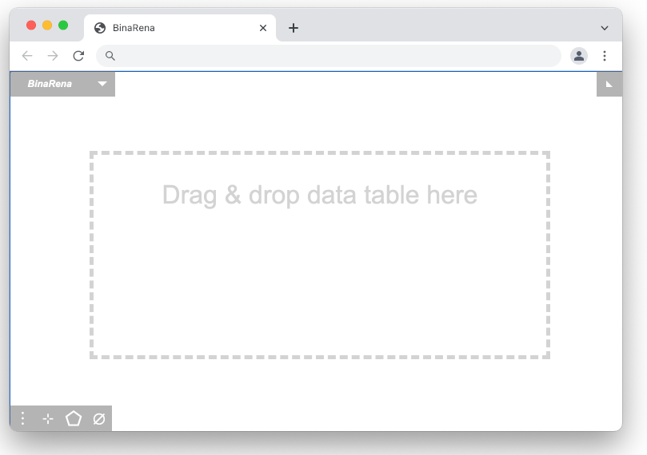


## Widget buttons

A few buttons in the bottom left corner trigger operations on the data:


- <span>&vellip;</span> (3 dots): Settings window.
- <span>&#10047;</span> (flower): Export image (PNG or SVG).
- <span>&#11040;</span> (polygon): Select contigs with a polygon.
- <span>&empty;</span> (empty set): Mask (hide) selected contigs.
- <span>&#9673;</span> (solid circle): Highlight selected contigs.
- <span>&#8889;</span> (cross): Focus on selected contigs.


## Mouse and keyboard shortcuts

The BinaRena interface is like a [**digital map**](https://www.google.com/maps) and is very intuitive. While although operations can be triggered through the graphical interface, the following basic operations are most convenient by using your mouse and keyboard.

- Drag the plot or use arrow keys (<code>&larr;</code>, <code>&uarr;</code>, <code>&rarr;</code> and <code>&darr;</code>) to move around.
- Zoom in/out: Mouse wheel, or use `=` and `-`.
- Click a contig to **select** it. Hold `Shift` and click to select multiple contigs.
- Click a selected contig to unselect it. Hold `Shift` and click to unselect multiple contigs.
- Press `Enter` to enter **polygon selection** mode. Then use mouse clicks to draw a polygon to contain multiple contigs. Press `Enter` again to complete selection. Hold `Shift` while pressing the second `Enter` to add contigs to the existing selection.
- Press `Delete` or `Backspace` to **mask** selected contigs. Press `Z` to undo.
- Press `L` to **highlight** selected contigs.
- Press `F` to **focus** on (hide all but) selected contigs.
- Press `Space` to **create a new bin** from selected contigs.
- Click a **bin name** to select it and all member contigs. Click it again to edit its name. Hold Shift and click to select multiple bins.
- Press `.` (`>`) to **add** selected contigs to the current bin, press `,` (`<`) to **remove** selected contigs from the current bin, press `/` to **update** the current bin with selected contigs (i.e., replace its content).
- Press `0` to reset the plot view.


## Input data

### Data table

BinaRena works on an entire **metagenomic assembly**, i.e., a collection of **contigs** (note: this document does not differentiate contigs, scaffolds, or long reads). The information being handled is the properties of individual contigs.

The input file format is a **data table** (tab-delimited file, or [TSV](https://en.wikipedia.org/wiki/Tab-separated_values)) that stores properties of contigs (scaffolds) in an assembly. Here is an [example](examples/input.tsv).

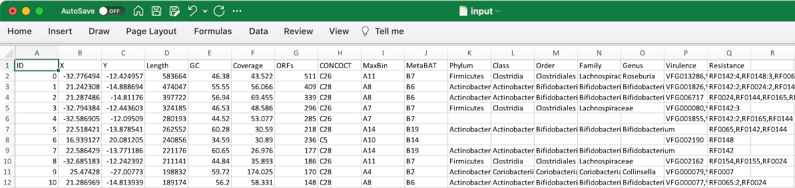

Each row represents one contig. The first column must be unique contig identifiers. The remaining columns are arbitrary properties. Empty cells will be treated as **missing** values.

To **load** a dataset, simply **drag and drop** the data file into the blank program window.

To **append** additional data to an opened dataset, just drag and drop more files. They will be filtered to match the current contig IDs (first column).

To work on **multiple** datasets simultaneously, just open multiple browser tabs.

Also check out these [Python scripts](scripts) which help with data preparation.

### Data types

Once a data table is loaded, BinaRena will prompt you to specify the data types of individual fields (columns):

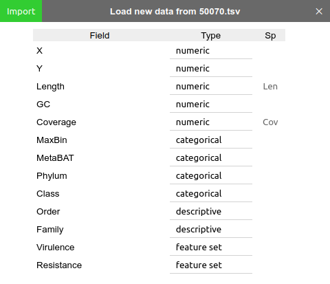

Each field may be any of the following four types:

- **numeric**(`n`): Such as length, coverage, GC%, etc. Can be either integers or floating point numbers.
- **categorical**(`c`): Such as taxonomic groups, external binning plans, etc.
- **feature set**(`f`): Features associated with each contig, such as genes. Should be written as comma-separated identifiers, such as "`dnaK,rpoB,ftsZ`".
- **descriptive**(`d`): Arbitrary free text, such as comments.

BinaRena will "guess" the most appropriate data type of each field based on the data. But you should still review, and correct any place where the program isn't smart enough.

One way to avoid manual review every time you open the same dataset, is to append a type code to a field name following a pipe (`|`), such as "`genes|n`" and "`plasmid|c`", in the raw TSV file.

### Special columns

Two properties are treated specially in BinaRena: **length** (bp) and **coverage** (x) of contigs, as they will be used to calculate bin abundance and to normalize bin summary metrics. They can be specified under the "Sp" column of the data import window ("Len" and  "Cov"). BinaRena attempts to "guess" these two columns from the numeric columns based on their names (see [how](#automatic-assignment)), but you still need to review, and correct if needed.

It is okay not to have either or both of these two columns in your dataset.

You can change these assignments later in the "Settings" window. This is useful when you explore a co-assembly with different coverage profiles of individual samples.

### Table view

During the analysis, one can click `Show data` from the context menu to open a window to browse the current dataset. Alternatively, when one or more bins are selected, one can click the <span>&#9707;</span> button in the bin table toolbar to browse the data of contigs **within** these bins. Click `Export` to save the data table as a TSV file.

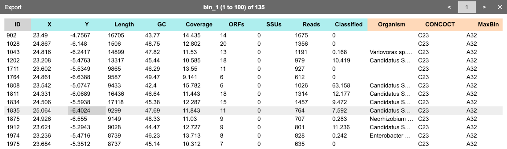

### [Scripts](scripts)

BinaRena ships with multiple Python scripts to help with preparing input data. They provide _k_-mer counting and dimensionality reduction (PCA, tSNE and UMAP) workflows, and format parsers that handle the output of bioinformatic tools such as SPAdes, MEGAHIT, Kraken, GTDB-tk, and CheckM.

Check out this [directory](scripts) for the scripts and documentation.


## Display items

BinaRena is an interactive scatter plot of contigs, with five display items:

- **x-axis**, **y-axis**, **size** (radius of contig), **opacity** (alpha value), and **color**.

Each display item can be changed and tweaked in the **display panel**. When the user moves the mouse of an item, two button will emerge, one letting the user select a data transformation method, and the other letting the user display a legend.

### Automatic assignment

When a dataset is loaded, BinaRena attempts to make the best guess of appropriate display items based on the names and types of individual fields. Specifically, it will look for these keywords in the column names:

- **_X_-axis** (numeric): `x`, `xaxis`, `x1`, `axis1`, `dim1`, `pc1`, `tsne1`, `umap1`, etc.
- **_Y_-axis** (numeric): `y`, `yaxis`, `x2`, `axis2`, `dim2`, `pc2`, `tsne2`, `umap2`, etc.
- **Length (bp)** (numeric): `length`, `size`, `len`, `bp`, etc.
- **Coverage (x)** (numeric): `coverage`, `depth`, `cov`, etc.
- **GC content (%)** (numeric): `gc`, `g+c`, `gc%`, `gc-content`, etc.
- **Taxonomy** (categorical): `phylum`, `class`, `order`, `family`, `genus`, etc.

The matching process is case-insensitive. Suffixes after common delimiters (" ", "/", "_", ".") are stripped. For examples, `Length (bp)` and `size_of_scaffold` will be recognized as **length**.

If all columns are found, BinaRena will render _x_- and _y_-axes in linear scale, length as marker size (radius) in cube root scale (because a sphere's volume is proportional to the cube of radius), coverage as marker opacity in square root scale, and highest taxonomic group as marker color.

If _x_- and/or _y_-axes are not found, the program will render a length by coverage plot.

If none is found, the program will take the first two numeric columns as _x_- and/or _y_-axes.

It's very likely that BinaRena is not smart enough to hit the desired view. You will need to tweak the display items as needed.

### Legends and data scaling

BinaRena provides interactive legends to inform the user of the (**numeric**) data. Move the mouse over the legend to see the original value in real time. Menwhile, two brackets will show up at the edges of the legend. Drag them to modify the displayed range of data. The lower limit is clickable. It lets the user toggle between zero or minimum value in the data.

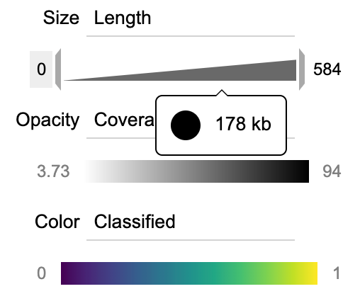

### Data transformation

Biological data are usually highly skewed. To effectively display them, proper [transformation](https://en.wikipedia.org/wiki/Data_transformation_(statistics)) is usually necessary. BinaRena provides various transformation methods that can be easily selected from a dropdown menu next to the field selection box.

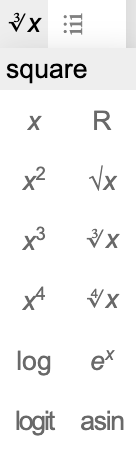

Specifically, BinaRena supports the following transformations:

- Square, cube, 4th power.
- Square root, cube root, 4th root.
- Logarithm and exponential.
- [Logit](https://en.wikipedia.org/wiki/Logit) and [arcsine](https://en.wikipedia.org/wiki/Binomial_proportion_confidence_interval#Arcsine_transformation) (for proportion data).
- [Ranking](https://en.wikipedia.org/wiki/Ranking#Ranking_in_statistics).

Note: Certain values may become invalid after certain transformation. For example, zero and negative numbers cannot be log-transformed. In such cases, the contigs will be displayed using the default setting (e.g., color is grey).

### Color coding

The color panel has an additional dropdown menu to let the user choose from multiple standard color palettes.

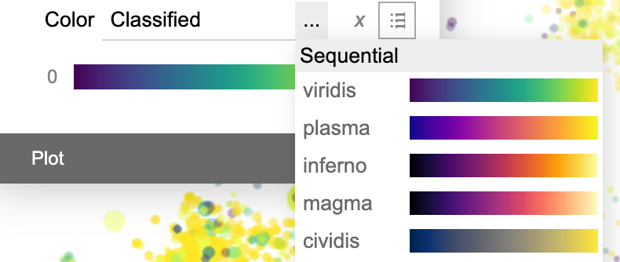

For **categorical** data, BinaRena automatically identifies and colors the **most frequent** categories in the dataset, while leaving all remaining categories in black. One may use the floating <span style="background-color: lightgrey;">&plus;</span> and <span style="background-color: lightgrey;">&minus;</span> buttons to increase / decrease the number of colored categories.

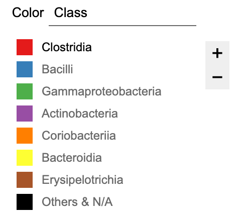

### Image export

The plot rendered by BinaRena can be exported as an image file. There are two options for doing this:

1. Press `P` or click the <span>&#10047;</span> (flower) button to take a screenshot of the current view and save as a [PNG](https://en.wikipedia.org/wiki/Scalable_Vector_Graphics) (portable network graphics) file.

2. Mouse over the <span>&#10047;</span> button and select "SVG" in the expanded menu. This will generate an 
[SVG](https://en.wikipedia.org/wiki/Scalable_Vector_Graphics) (scalable vector graphics) file. It is a vector image therefore it can be further edited in vector image editing programs, such as [Inkscape](https://inkscape.org/). Compared with PNG which is a bare screenshot, the SVG image has _x_- and _y_-axes ticked, labeled, and aligned to "nice" tick numbers, and legends (size, opacity and/or color) displayed in the plot. It is suitable for further processing to generate publication-quality figures.

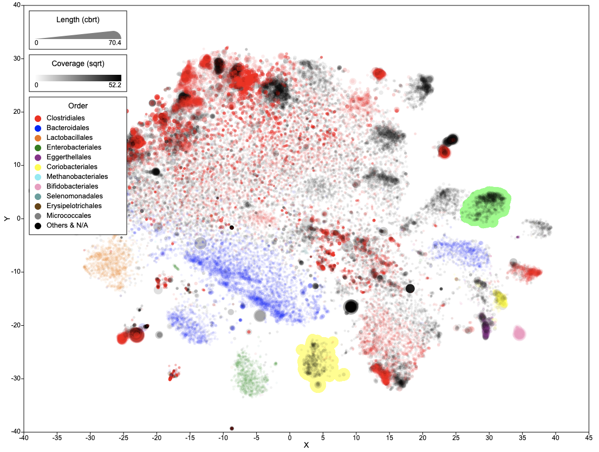


## Contig selection

In the interactive scatter plot, one can simple click circles (**contigs**) to select them. Hold `Shift` and click to select multiple. Click selected ones to unselect them.

A more efficient may is to press `Enter` or click the <span>&#11040;</span> button in the corner to enter the **polygon** selection mode.

Then one can click on the plot to draw a polygon to contain contigs of interest. When done, press `Enter` again and these contigs will be selected.

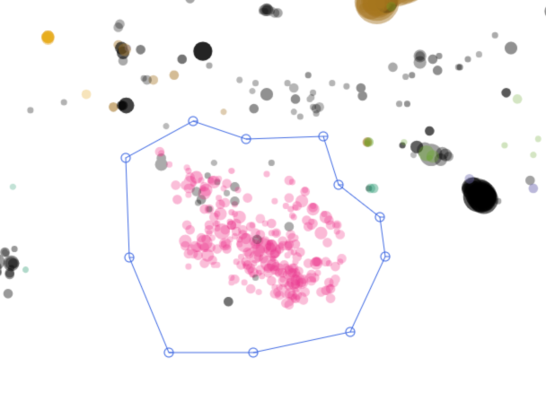

Hold `Shift` when finishing selection will add the contigs to the current selection.


## Contig masking

One can press the `Delete` key or click the <span>&empty;</span> button in the corner to **mask** currently selected contigs. These contigs will disappear from the plot. They will also be excluded from subsequent operations (e.g., they cannot be selected, nor can they influence calculation of metrics). This function is useful for cloaking unwanted contigs during binning.

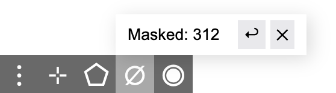

The masked contigs are not deleted from the dataset. They can be released back to the view by clicking the <span>&times;</span> button.

One can also press `Z` or click the <span>&#8617;</span> button to **undo** previous masking operations one by one. The program allows a total of 50 regrets.

- Note that masked contigs will not be immediated deleted from bins. One can click the <span>&empty;</span> button in the bin table toolbar to remove masked contigs from all bins.


## Contig highlighting

One can press the `L` key or click the <span>&#9673;</span> button in the corner to **highlight** currently selected contigs. Moreover, one may select one of multiple highlight colors from the menu.

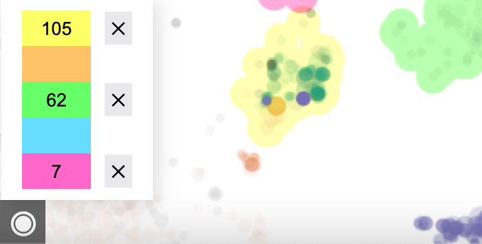

The highlight will stay with the contigs no matter how the layout and display items change, until the user click the <span>&times;</span> button next to each color to release them.

Highlighting will not affect binning, search, calculation and operations. It serves as a visual annotation of contigs to make them noticeable to the user.


## Contig focusing

Press the `F` key or click the <span>&#8889;</span> (cross) button in the corner to **focus** on selected contigs. That is, all but these contigs will be hidden, allowing you to concentrate on them. When you complete working on these contigs, press `F` again and bring back all other contigs.


## Contig summary

BinaRena displays a summary of properties of the select contigs in real time to let the user see what's included. Each row represents a field. When the user moves the mouse over a row, a mini control panel will show up.

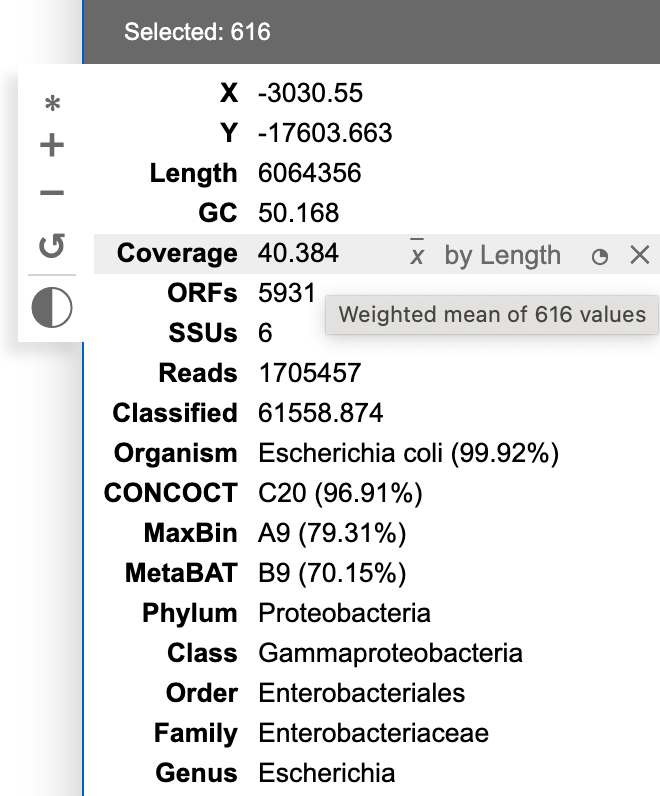

When multiple contigs are selected, the displayed value of **numeric** fields is calculated using either **mean** (<span style="background-color: lightgrey; text-decoration: overline;"><i>x</i></span>) or **sum** (<span>&Sigma;<i>x</i></span>) of the contigs, optionally **weighted** by another variable. BinaRena attempts to "guess" the most relevant metric for each column. For examples, "length" should be the sum of lengths of all contigs, whereas "coverage" should be the average of coverages of the contigs, weighted by contig length. One can mouse hover the displayed value to see how it is exactly calculated, and tweak the metrics (in case BinaRena didn't guess right).

For **categorical** columns, the displayed category is the **majority-rule** category, if there are multiple options (i.e., the selected contigs are a mixture), determined by weighting against the contig length (one can tweak this). The relative frequency of the main category is displayed in the parentheses. If no category is over half, the row will be displayed as "ambiguous", while the most frequent category can be found in the tooltip during mouse hovering.

One may click the <span>&#9684;</span> button in each row to display a histogram of the distribution of this variable in a [mini plot](#mini-plot).


## Contig searching

The **Search** panel offers functions to search the assembly for contigs that match given criteria.

For numeric fields, enter (or leave empty) maximum and minimum thresholds. Click the boundaries to toggle between exclusion (`()`) and inclusion (`[]`).

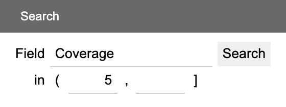

For categorical, feature set and descriptive fields, enter a keyword to search. The keyword box can auto-complete based on current categories and features. Click `Aa` to toggle case sensitivity and `""` to toggle whole/partial matching.

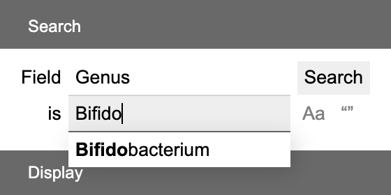

For feature set field, the whole contig will match as long as any feature on it matches.


## Mini plot

The mini plot panel displays an interactive **histogram** of a user-chosen variable of the selected contigs. Mouse over the bars to display the range and size of them. Click `log` to apply log-transformation. Click `+` and `-` to increase / decrease the number of bars.

One may use mouse **dragging** to select a range of bars. The contigs will be filtered down to the selected range.

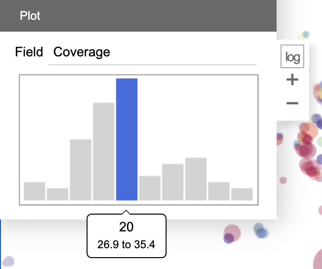

This miniplot faciliates the user to observe the distribution of the variable in a set of contigs, and further perform filtering based on the observation. For examples, one may remove **contaminations** from a bin which appear to be outliers in the histogram; one may also separate two **closely related strains** which show a bimodal distribution in the histogram.


## Binning plan

One may create a binning plan from _de novo_ or load an existing one from a **categorical** field. Each category represents a bin. The name, number of contigs (`#`), total length of contigs (`kb`) and the relative abundance (calculated as length x coverage, then normalized against the entire assembly) are displayed.

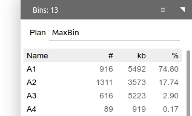

When a binning plan is modified (added/removed bins, added/removed contigs to/from bins, renamed bins, entered a new plan name, etc.), a <span>Save</span> button will show up. Click it to save the **binning plan** as a categorical field.

Alternatively, click the <span style="background-color: lightgrey;">&rarrb;</span> button in the toolbar to export the binning plan to a text file. The format will be a mapping of bin names to member contig IDs.


## Table of bins

The table below the binning plan name displays a list of bins in the plan. Click a bin to select it. The contigs in this bin will be [selected](#contig-selection) in the same time and their properties will be [summarized](#contig-summary).

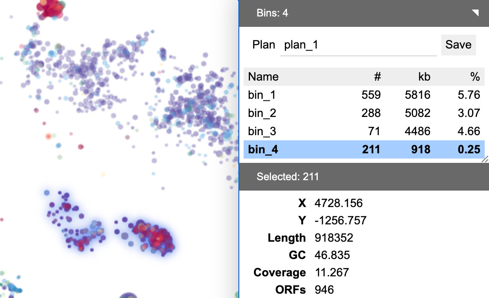

Click the bin again to edit its name. Press `Enter` when done. Hold `Shift` and click to select multiple bins.

The toolbar next to the bin table provides a few utilities. Click <span style="background-color: lightgrey;">&plus;</span> to create an empty new bin. Click <span style="background-color: lightgrey;">&minus;</span> to delete the selected bin(s), Click <span style="background-color: lightgrey;">&cup;</span> to merge multiple bins.

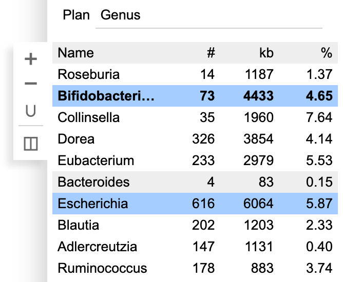


## From selection to bin

Press `Space` to **create a new bin from selected contigs**. If no binning plan is currently loaded, the program will create a new plan. This is perhaps the easiest way to start **de novo binning** using the program.

Press `.` to add selected contigs to the select bin. Press `,` to remove selected contigs from the selected bin. Press `/` to update (replace) the selected bin with selected contigs.

These functions can also be found in the toolbar next to the summary table.


## Binning confidence evaluation

BinaRena can evaluate the **confidence** of binning by calculating the [**silhouette coefficient**](https://en.wikipedia.org/wiki/Silhouette_(clustering)). Specifically, a silhouette coefficient measures how similar a contig is to other contigs in the same bin, as in contrast to contigs in other bins. It ranges from -1 (worst) to 1 (best).

One may click the <span>&#9739;</span> button in the toolbar next to the binning plan to open the "silhouette coefficient" window. It allows the user to select variables to be included in the calculation.

- Note: Only select variables that are presumably **homogeneous** in each bin (e.g., GC%, coverage, _k_-mer frequency). Don't select those that aren't (e.g., length of contig).

Then click the "calculate" button to start calculation. When done, the mean silhouette coefficient of each bin and all bins will be displayed in a table.

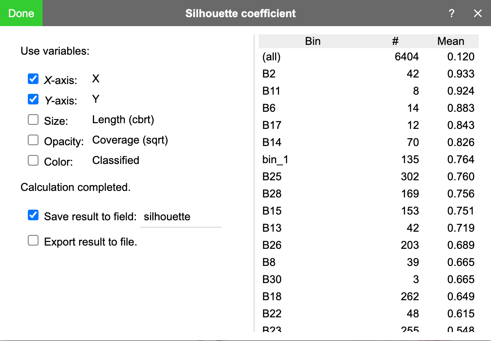

Before pressing "done", one may check "save result to field" to save the calculated silhouette coefficient to a categorical field. BinaRena will automatically color the contigs using these values, from which one can immediately see which bins are of high overall confidences and which contigs are confidently belonging to their bins. This can guide the subsequent binning efforts.

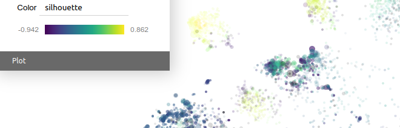

One may also check "export result to file" to save the results (contig IDs, bin assignments and silhouette coefficients) to a TSV file.

- Be warned not to over-interpret silhouette coefficient. It is a widely-used metric for [cluster analysis evaluation](https://en.wikipedia.org/wiki/Cluster_analysis#Evaluation_and_assessment). However, other biological factors may also be important in the task of binning.


## Binning plan comparison

BinaRena compares two binning plans by calculating the [**adjusted Rand index**](https://en.wikipedia.org/wiki/Rand_index) (ARI), which measures the **consistency** between two grouping scenarios of the same dataset. Higher is better. Two identical plans have ARI = 1. Two random plans will have an ARI close to 0.

One may click the <span>&harr;</span> button in the toolbar next to the binning plan, then select a categorical field (another binning plan) to perform this calculation. It is fast. The result will be displayed in a floating message box.


## Completeness & redundancy calculation

BinaRena can calculate these two critical metrics **in real time** on user-selected contigs, as in contrast to classical methods which normally run after bins are already defined.

What are completeness and redundancy? Given a feature group as defined by its membership (i.e., it contains these _n_ features: _f_<sub>1</sub>, _f_<sub>2</sub>,... _f<sub>n</sub>_), **completeness** is the number / fraction of these features found in the selected contigs; **redundancy** (a.k.a., **contamination**) is the number / fraction of extra copies of these features present in the contigs.

To use this function, you first need to have a "feature set" column in the dataset (see [details](#data-types)). For example, this can be the KEGG ontology (KO) annotations of predicted genes on each contig:

```
k99_1 <tab> K00986
k99_3 <tab> K02117,K02122,K02124,K02123,K02119,K03439
k99_10 <tab> K18349,K18479,K00763,K07098,K04769
k99_39 <tab> K25232,K07729,K02871,K02996
k99_62 <tab> K00655
...
```

Then you need a separate file, which is a plain list of member features of a particular feature group. In this example, it is the KOs of the glycolysis pathway ([ko00010](https://www.genome.jp/entry/ko00010)).

```
K00844
K12407
K00845
K25026
K01810
...
```

Drag and drop this file into BinaRena. The program will recognize and prompt you to associate it with a feature set column.

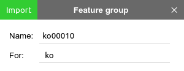

Then, whenever there are some contigs selected, you can go to the summary panel's dropdown menu, select "Feature group", then select the feature group name. The program will report the completeness and redundancy values right away.

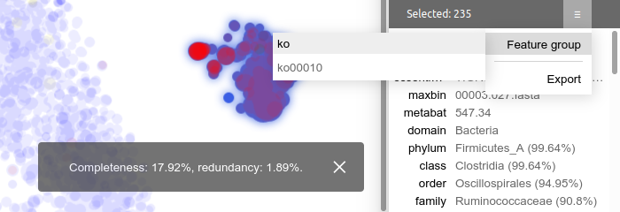

You can load arbitrary number of feature groups for any number of feature set columns simultaneously. This lets you explore various biological questions with high flexibility.

BinaRena provides scripts for converting [CheckM](https://ecogenomics.github.io/CheckM/) lineage-specific marker genes into feature sets and feature groups, so that you can calculate the bin quality metrics **on the fly** in BinaRena. See [details](scripts##checkm-marker-genes).

- [Note] BinaRena does not consider feature interchangeability -- for example, both K00845 and K12407 encode for glucokinase and an organism may just need one of them. One should be cautious in defining feature groups and interpreting the resulting numbers.


## FAQ

**Is BinaRena really dependency-free?**

That is accurate. The program uses zero third-party libraries, not even Node.js, either locally or remotely (i.e., it doesn't src any remote web framework or icon pack in the `<script>` section). The entire program is handcrafted. This minimizes the effort for deployment and usage.

In addition, we use [Jasmine](https://jasmine.github.io/) for [unit testing](https://en.wikipedia.org/wiki/Unit_testing) core algorithms to ensure their soundness. Jasmine is bundled in the package, but it won't run when you use BinaRena.

**Does BinaRena expose my data to a remote server?**

The standalone BinaRena program is a client-end webpage that runs in your browser. Theoretically and technically, it cannot communicate with a web server. There is no risk with regard to the confidentiality of your data.

The live demo hosted by [GitHub Pages](https://pages.github.com/) can communicate with the GitHub repository, and the only thing it does is to [retrieve](demo.html) the sample dataset from the repository directory. It does not perform any other communication.

### Hardware

**What system configuration does BinaRena require?**

A typical laptop is sufficient for running BinaRena.

**Does BinaRena work on a touchscreen?**

Yes! You can use your finger(s) to move and zoom the plot, as well as to select contigs, to click buttons, etc.

### Software

**Which operating systems support BinaRena?**

Any operating system that can run a web browser supports BinaRena. Windows, macOS, Linux, Android,... you name it.

**Which web browsers support BinaRena?**

BinaRena runs in most modern web browsers, including **Chrome**, **Firefox**, **Edge**, and **Safari** (see screenshots below).

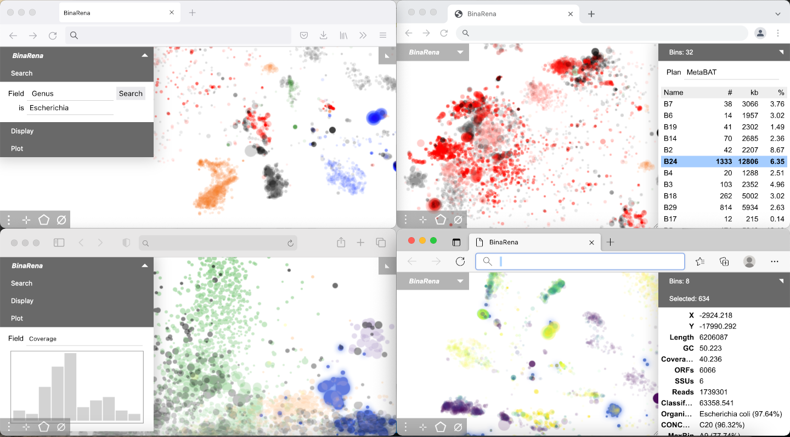

**Do old browsers support BinaRena?**

BinaRena is written in JavaScript, using modern language standards including [ES6](https://www.w3schools.com/js/js_es6.asp) and above. Modern browsers shouldn't have problems as they normally auto-update to meet the latest standards. However, very outdated browsers such as Internet Explorer may not support BinaRena.

### Graphics

**Which browser works the best for BinaRena?**

They all work very well. However some may bring you moderately smoother graphics than others do, for the following reason:

For high responsiveness, BinaRena automatically caches images around the current viewport, so that it could immediately bring you to the destination when you move or zoom. BinaRena uses either of two mechanisms to achieve this: For browsers that support [OffscreenCanvas](https://developer.mozilla.org/en-US/docs/Web/API/OffscreenCanvas), BinaRena uses this technology to cache images in a separate thread so that it won't block the UI. For others, BinaRena scavenges [idle time](https://developer.mozilla.org/en-US/docs/Web/API/Window/requestIdleCallback) in the main thread to cache images, which could lag the graphics a little bit.

So which browsers support this technology? As of 2022, Chrome does, out-of-the-box, therefore you get the highest FPS when you run BinaRena in Chrome. So does Edge. Firefox has support but you need to manually turn it on, by enabling `gfx.offscreencanvas.enabled` in `about:config` (see [details](https://developer.mozilla.org/en-US/docs/Web/API/OffscreenCanvas)). If you are too scared of this setting, just leave as is. Safari does not support this.

If this causes any problem, you may comment out the code under "check offscreen canvas support" in [static/js/main.js](static/js/main.js) to disable OffscreenCanvas (even if the browser supports it).

**BinaRena doesn't display graphics in my browser?**

We haven't experienced this scenario in any modern browser. But just in case your browser is highly customized or restricted... See if the previous answer helps you. If not, you will need to install a clean browser.

**BinaRena is sometimes smooth but sometimes clumsy?**

BinaRena can become clumsy when the dataset is large and when you are making frequent operations on the graph, such that the background caching process (see above) hasn't completed. This won't break anything. Wait for a few seconds and you will find it smooth.

### Plotting

**How to precisely control the size of the plot?**

Drag to resize the browser window. The plot will be resized along with it, during which its width and height (in unit of pixel) will be displayed in a floating message box.

**Can BinaRena display axes and ticks?**

Yes. Check "Plot grid" in "Settings". There will be an interactive grid with numbers. Alternatively, in the exported SVG, axes and labels are automatically rendered.

**Where are the color palettes in BinaRena from?**

Most of these color palettes were adopted from [Matplotlib](https://matplotlib.org/stable/tutorials/colors/colormaps.html), which have been widely utilized in Python data science. The default categorical palette "QIIME" was adopted from the EMPeror viewer of the microbiome data analysis package [QIIME 2](https://qiime2.org/).

**Can I customize the color palettes?**

Not from the GUI. But look into [static/js/resource.js](static/js/resource.js) and you know what to do.

**In the exported SVG image, some data points are covered by the legends. Can I move the legends outside the plot?**

The data points are covered, but they are not missing. One can open the SVG file in a vector image editor such as [Inkscape](https://inkscape.org/), and move the legends away from the plot area. The covered elements will be revealed.

**Can I customize the appearance of the exported SVG image?**

The GUI doesn't provide much control. However, pro users can look into ([static/js/svg.js](static/js/svg.js)). On top of the function `renderSVG` there are multiple customizable parameters.

### Calculation

**How does BinaRena perform [data ranking](https://en.wikipedia.org/wiki/Ranking#Ranking_in_statistics)?**

BinaRena sorts numeric values from small to large and assign them ranks 1, 2, 3... If there are ties, all numbers in a tie will receive the **average** rank of them. This behavior is consistent with the default behavior of SciPy's [`rankdata`](https://docs.scipy.org/doc/scipy/reference/generated/scipy.stats.rankdata.html) function.

**How exactly does BinaRena calculate silhouette coefficients?**

The silhouette coefficient calculation algorithm in BinaRena was implemented in reference to Scikit-learn's [`silhouette_score`](https://scikit-learn.org/stable/modules/generated/sklearn.metrics.silhouette_score.html) function to achieve compatible results. Prior to this final step, several operations are involved for data preprocessing:

The contigs are filtered to exclude those 1) that are not in any bin, 2) that are currently [masked](#contig-masking), 3) that have invalid values in any of the variables after [transformation](#data-transformation). The remaining data are subject to [min-max scaling](https://en.wikipedia.org/wiki/Feature_scaling#Rescaling_(min-max_normalization)) (consistent with the default behavior of Scikit-learn's [`MinMaxScaler`](https://scikit-learn.org/stable/modules/generated/sklearn.preprocessing.MinMaxScaler.html)) such that each variable is within the range of [0, 1]. Then, the pairwise [Euclidean distances](https://en.wikipedia.org/wiki/Euclidean_distance) between contigs are calculated using the scaled variables. Finally, the silhouette coefficients were calculated.

One can monitor the process and intermediates using the browser's **console**.

**Why does silhouette coefficient calculation take so long?**

Calculation of silhouette coefficients requires calculating Euclidean distance between every pair of contigs, which is computationally expensive (_O_(_n_<sup>2</sup>)). Therefore the computing time quickly builds up as the dataset becomes larger.

The program has an optimization for less than 20,000 contigs. Below this threshold, calculation is synchronous and faster (vs. data size). Above this threshold, the calculation progress will displayed and the user has the option to abort the calculation when running out of patience.

For efficient computing, one may consider filtering down the dataset (e.g., removing short and shallow contigs) and/or masking irrelevant contig groups (masked contigs won't participate in calculation).


## Citation

A manuscript describing BinaRena and its use cases in microbiome research is preprinted at:

> MJ Pavia, A Chede, Z Wu, H Cadillo-Quiroz, Q Zhu. BinaRena: a dedicated interactive platform for human-guided exploration and binning of metagenomes. _bioRxiv_ (2022). doi: https://doi.org/10.1101/2022.06.28.498025.

## Contact

Please forward any questions to the project leader: **Dr. Qiyun Zhu** (qiyunzhu@gmail.com).
